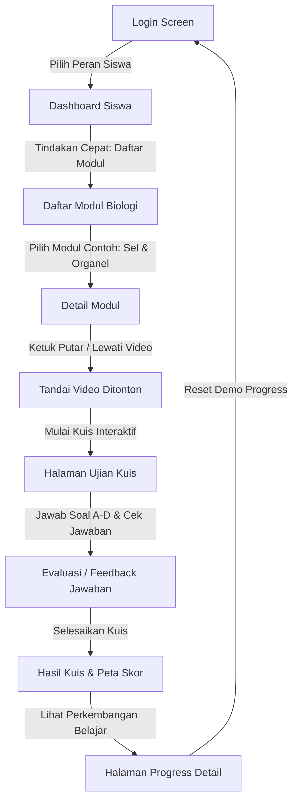

# 🧬 BioLearn

> **Belajar Biologi Lewat Video Pembelajaran, Ringkasan Materi, dan Kuis Interaktif**

BioLearn adalah aplikasi pembelajaran mobile berbasis Android & iOS yang dirancang khusus untuk mempermudah siswa SMA dalam mendalami materi Biologi. Terinspirasi dari platform belajar modern seperti Ruangguru, BioLearn hadir dengan visualisasi bersih, performa gesit, dan fungsionalitas luring (offline) tanpa ketergantungan database eksternal untuk keperluan demo presentasi klien yang 100% bebas hambatan.

---

## 🎯 Target Pengguna & Value Utama
- **Target Pengguna:** Siswa Sekolah Menengah Atas (SMA) Kelas 10, 11, dan 12 yang mempersiapkan ujian sekolah maupun seleksi kuliah.
- **Value Utama:**
  - **Efisiensi Belajar:** Menyajikan video pemateri handal, ringkasan materi berpoin kunci, serta contoh kasus sehari-hari.
  - **Evaluasi Cerdas (KKM 70):** Latihan kuis pilihan ganda yang interaktif dengan grading otomatis dan ulasan penjelasan jawaban instan.
  - **Rekomendasi Pembelajaran Adaptif:** Sistem pintar mendeteksi bab biologi yang nilainya masih di bawah KKM atau video materi yang belum selesai ditonton, kemudian menyajikan saran langkah belajar berikutnya.

---

## 🛠️ Stack Teknologi & Batasan Dependensi

Untuk menjamin kompatibilitas 100% dengan aplikasi **Expo Go** pada saat presentasi langsung, dependensi proyek dikunci pada versi-versi stabil berikut:

- **Expo SDK:** `v54.0.0` (Target Android & iOS)
- **React Native:** `v0.81.5`
- **React:** `v19.1.0`
- **State Management:** `Zustand` (Tanpa Redux yang kompleks)
- **Router:** `Expo Router` (File-based Routing dengan typed routes diaktifkan)
- **Video Player:** `expo-video` (Digunakan di detail modul)
- **Data Persistence:** Mock Local Database (Zustand State, Bebas SQLite/Supabase/Firebase/AsyncStorage untuk keperluan demo instan)

---

## 🌟 Fitur MVP yang Sudah Selesai
1. **Role Login Dummy:** Halaman masuk berbasis peran (Siswa, Guru, Admin Konten) dengan guard proteksi rute halaman yang aman.
2. **Dashboard Siswa MVP:** Visualisasi ringkasan statistik belajar, modul aktif yang sedang dipelajari, skor kuis terakhir, dan kotak rekomendasi pintar.
3. **Daftar Modul Biologi:** Halaman kurikulum biologi SMA dengan tab penyaring kelas (Semua, 10, 11, 12), badge tingkat kesulitan, dan indikator status penyelesaian modul.
4. **Detail Modul & Mock Video Player:** Membaca video pembahasan materi biologi lengkap dengan mock player berfitur interaktif (Play/Pause, Skip ±30s, volume, dan auto-completion).
5. **Ringkasan Materi & Contoh Penerapan:** Rangkasan materi biologi penting beserta contoh penerapan konkret di kehidupan nyata.
6. **Kuis Interaktif Pilihan Ganda (A-D):** Alur ujian interaktif disertai panel evaluasi instan (penjelasan benar/salah & pembahasannya).
7. **Hasil Kuis & Peta Skor:** Menampilkan skor total kelulusan berdasar KKM (70), jumlah jawaban benar, stempel waktu belajar, serta instruksi perbaikan.
8. **Progress Belajar Detail:** Statistik menyeluruh tentang modul selesai, video ditonton, rata-rata skor, bab remedial, dan rekomendasi langkah berikutnya.
9. **Reset Demo Progress:** Tombol cepat di dashboard untuk mengosongkan progress belajar kembali ke awal guna keperluan demo berulang-ulang.

---

## 🔄 Alur Navigasi Aplikasi (Demo Flow)

Ikuti urutan langkah demonstrasi berikut untuk menampilkan kemampuan aplikasi secara penuh:



1. **Langkah 1 (Pilih Role):** Masuk sebagai **Siswa** di halaman login awal.
2. **Langkah 2 (Dashboard Siswa):** Lihat data statistik belajar awal yang masih kosong (0%) dan rekomendasi untuk mulai belajar.
3. **Langkah 3 (Daftar Modul):** Buka daftar modul, saring berdasarkan kelas 11 untuk melihat klasifikasi topik.
4. **Langkah 4 (Buka Detail Modul):** Ketuk modul *"Sel dan Organel"* untuk masuk ke Ruang Belajar.
5. **Langkah 5 (Tonton Video):** Putar pembahasan video biologi atau ketuk tombol *"Tandai Video Selesai Ditonton"*. Status video akan berubah menjadi hijau.
6. **Langkah 6 (Kerjakan Kuis):** Gulir ke bawah dan ketuk tombol *"Mulai Kuis"*. Kerjakan kuis pilihan ganda yang menyajikan 3 butir soal. Amati panel penjelasan yang muncul sesaat setelah menekan *"Cek Jawaban"*.
7. **Langkah 7 (Skor Ujian):** Selesaikan kuis dan amati kartu skor kelulusan Anda di halaman hasil kuis.
8. **Langkah 8 (Pantau Progress):** Buka halaman *"Progress Belajar Detail"* untuk melihat pergerakan diagram progress, daftar remedial (jika nilai < 70), serta status tiap bab.
9. **Langkah 9 (Reset Demo):** Kembali ke dashboard dan ketuk tombol *"Reset Progress Demo"* untuk mengembalikan aplikasi ke kondisi awal yang bersih.

---

## 📁 Struktur Folder Proyek

```
BioLearn/
├── app/                  # Rute Halaman Aplikasi (Expo Router)
│   ├── _layout.tsx       # Root layout & penyedia tema adaptif
│   ├── index.tsx         # Halaman login simulasi peran
│   ├── dashboard.tsx     # Beranda visual siswa/guru/admin
│   ├── modules.tsx       # Kurikulum biologi & tab filtering
│   ├── module-detail.tsx # Ruang belajar, ringkasan, & video
│   ├── quiz.tsx          # Ujian pilihan ganda & panel feedback
│   ├── quiz-result.tsx   # Hasil kuis & rekomendasi perbaikan
│   └── progress.tsx      # Rapor kemajuan belajar & bab remedial
├── components/           # Komponen UI Reusable Premium
│   ├── AppButton.tsx     # Tombol interaktif dengan efek skala
│   ├── AppCard.tsx       # Kontainer bayangan halus (soft shadow)
│   ├── DifficultyBadge.tsx # Label penanda tingkat bab
│   ├── InstructorCard.tsx # Profil kartu pemateri modul
│   ├── ProgressBar.tsx   # Pengukur grafik persentase
│   ├── QuizOption.tsx    # Opsi pilihan ganda A-D interaktif
│   └── ScreenContainer.tsx # Pembungkus layar ramah area notch
├── constants/            # Konfigurasi Tema (Warna & Ukuran)
│   └── theme.ts
├── data/                 # Sumber Data Seed Lokal
│   ├── seedInstructors.ts
│   ├── seedModules.ts
│   └── seedQuestions.ts
├── store/                # Manajemen State Global
│   └── useLearningStore.ts # Zustand store & aksi belajar
└── types/                # Definisi Tipe Data TypeScript
    └── index.ts
```

---

## 🚀 Cara Menjalankan & Menguji Proyek

### 1. Persiapan Awal
Pastikan Anda berada di direktori proyek `/home/rey/Documents/BioLearn`. Pasang pustaka dependensi yang dibutuhkan:
```bash
npm install
```

### 2. Memulai Metro Bundler
Jalankan server pengembangan dengan mengosongkan cache Metro agar rute routing terindeks sempurna:
```bash
npx expo start -c
```
Pindai kode QR yang muncul menggunakan aplikasi **Expo Go** pada ponsel pintar Anda (pastikan ponsel berada di jaringan Wi-Fi yang sama).

### 3. Perintah Verifikasi Kualitas Codebase
Untuk memastikan kode bersih dari galat pengetikan TypeScript dan dependensi tetap selaras dengan SDK 54:

- **Verifikasi TypeScript:**
  ```bash
  npx tsc --noEmit
  ```
  *(Harus mengembalikan status sukses tanpa error / zero errors).*

- **Verifikasi Dependensi Expo:**
  ```bash
  npx expo install --check
  ```
  *(Harus mengembalikan output "Dependencies are up to date").*

---

## 🗺️ Roadmap Pengembangan Masa Depan
- [ ] **v0.2:** Penambahan fitur animasi transisi antar halaman (micro-interaction) & perbaikan performa pemutaran video.
- [ ] **v0.3:** Integrasi penyimpanan lokal menggunakan `AsyncStorage` agar kemajuan belajar siswa tersimpan permanen di HP.
- [ ] **v1.0:** Hubungan ke Backend Server Online (Express.js/Go) & Database cloud untuk multi-user login riil.
- [ ] **v1.5:** Pembuatan halaman Dashboard Guru secara lengkap (manajemen kelas, pemantauan progress siswa real-time, statistik kelulusan kuis).
- [ ] **v2.0:** Integrasi AI Tutor & Adaptive Learning (merekomendasikan materi biologi berdasarkan kesulitan kuis yang sering dihadapi).
